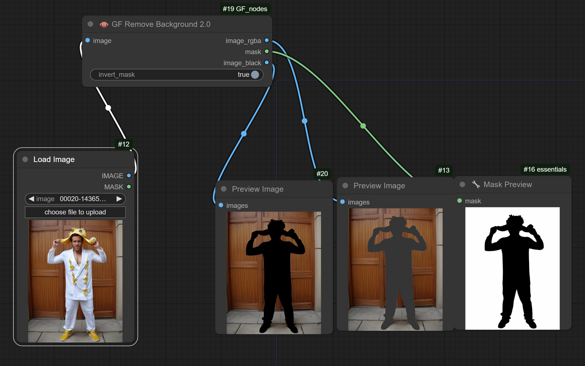

# RMBG-2.0 Background Removal Node for ComfyUI

This custom node for ComfyUI provides advanced background removal capabilities using the briaai/RMBG-2.0 model. It is designed to seamlessly integrate into the ComfyUI environment, offering users a powerful tool for image processing tasks.

**Node name:** GFrbmg2  
**Author:** GorillaFrame




## Features
- High-quality background removal
- Support for batch processing
- Options for inverted masks
- Three output formats: RGBA, mask, and black background

## Installation

### Required Directory Structure
```
ComfyUI/
├── models/
│   └── RMBG-2.0/  # Model files
│       ├── config.json
│       ├── model.safetensors (≈1.5GB)
│       └── other files...
└── custom_nodes/
    └── GF_nodes/
        ├── gfrbmg2.py  # Node implementation
        └── __init__.py  # Node initialization
```

### Installation Steps
1. **Create the GF_nodes Folder and Download the Model:**

   Navigate to your ComfyUI directory and set up the necessary folders:
   ```bash
   cd ComfyUI/custom_nodes
   git clone https://github.com/gorillaframeai/GF_nodes.git
   ```

2. **Download the RMBG-2.0 Model:**

   Navigate to the models directory and clone the model repository:
   ```bash
   cd ComfyUI/models
   git clone https://huggingface.co/briaai/RMBG-2.0 .
   ```

   If Git LFS is not installed, run:
   ```bash
   git lfs install
   git lfs pull
   ```

## Requirements
- CUDA-compatible GPU (recommended)

## Usage
1. Restart ComfyUI after installation
2. Find the node in "🐵 GorillaFrame/Image" category
3. Connect an image input
4. Get outputs: image_rgba (transparent background), mask, and image_black (black background)

## Credits
- Original model: [briaai/RMBG-2.0](https://huggingface.co/briaai/RMBG-2.0)
- Node implementation: @GorillaFrame 🐵